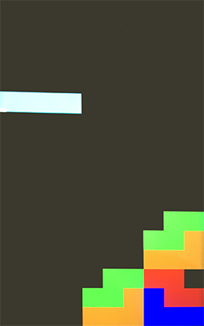

# Tetris created from using "Tutorial 5 - Creating a triangle" as a starting point

### Features added:
 - screen refresh so game updates are visible
 - custom touch inputs to play the game
 - removal of completed rows, however no visual for score tracking
 - spawn a random piece after last becomes part of the board
 - simplistic collision system for piece-board interaction

## Screenshot

   
  &nbsp;&nbsp;&nbsp;&nbsp;turned into&nbsp;&nbsp;&nbsp;&nbsp; 
  

## Controls

  
 Piece Translation - swipe in one of the three directions before taking your finger off the screen (touch release): 

   
  
  

# 

  
 Piece Rotation: 

   
  

  
A full circle is not required to be drawn to rotate a piece, instead the piece is rotated after each quarter circle is drawn as it's faster for the player to input. If the player ever makes a mistake they can quickly update the rotation by drawing in the opposite rotation as seen below:

   
  
The input above will result in the rotation before the input, however it will rotate once clockwise then wait for touch release or another rotation input before applying the last pending (counter-clockwise) rotation.

